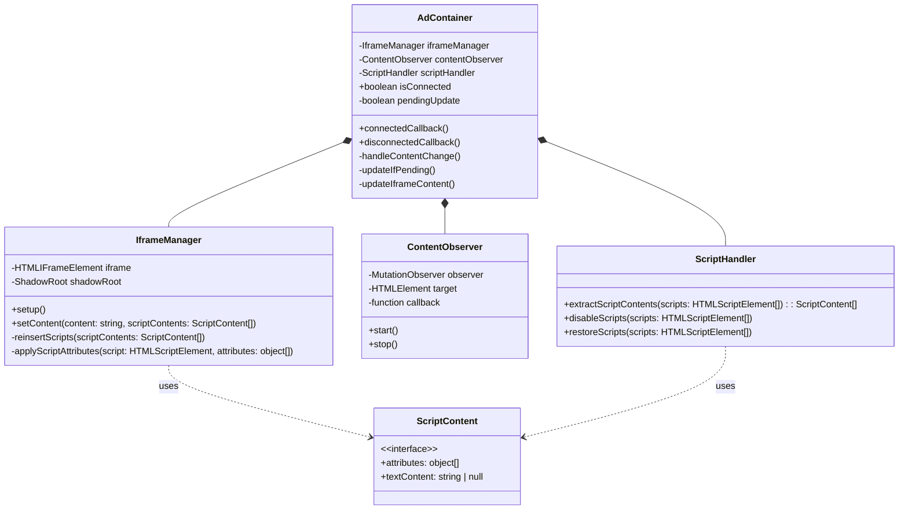

```mermaid
classDiagram
    class AdContainer {
        -IframeManager iframeManager
        -ContentObserver contentObserver
        -ScriptHandler scriptHandler
        +boolean isConnected
        -boolean pendingUpdate
        +connectedCallback()
        +disconnectedCallback()
        -handleContentChange()
        -updateIfPending()
        -updateIframeContent()
    }

    class IframeManager {
        -HTMLIFrameElement iframe
        -ShadowRoot shadowRoot
        +setup()
        +setContent(content: string, scriptContents: ScriptContent[])
        -reinsertScripts(scriptContents: ScriptContent[])
        -applyScriptAttributes(script: HTMLScriptElement, attributes: object[])
    }

    class ContentObserver {
        -MutationObserver observer
        -HTMLElement target
        -function callback
        +start()
        +stop()
    }

    class ScriptHandler {
        +extractScriptContents(scripts: HTMLScriptElement[]): ScriptContent[]
        +disableScripts(scripts: HTMLScriptElement[])
        +restoreScripts(scripts: HTMLScriptElement[])
    }

    class ScriptContent {
        &lt;&lt;interface&gt;&gt;
        +attributes: object[]
        +textContent: string | null
    }

    AdContainer *-- IframeManager
    AdContainer *-- ContentObserver
    AdContainer *-- ScriptHandler
    IframeManager ..> ScriptContent : uses
    ScriptHandler ..> ScriptContent : uses
```
