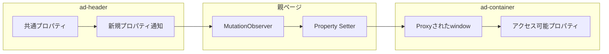

```mermaid
flowchart LR
    subgraph 親ページ
    MO[MutationObserver]
    PS[Property Setter]
    end
    
    subgraph ad-header
    CP[共通プロパティ]
    NP[新規プロパティ通知]
    end
    
    subgraph ad-container
    PX[Proxyされたwindow]
    AP[アクセス可能プロパティ]
    end
    
    CP --> NP
    NP --> MO
    MO --> PS
    PS --> PX
    PX --> AP
```