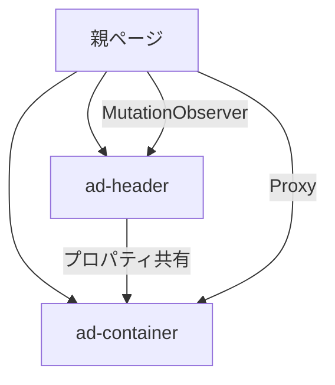
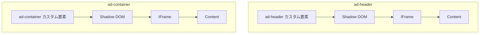

```mermaid
graph TD
    A[親ページ] --> B[ad-header]
    A --> C[ad-container ]
    B -- "プロパティ共有" --> C
    A -- "MutationObserver" --> B
    A -- "Proxy" --> C
```

```mermaid
graph TD
    subgraph ad-header[ad-header]
        E[ad-header カスタム要素] --> F[Shadow DOM]
        F --> G[IFrame]
        G --> H[Content]
    end
    subgraph ad-container[ad-container]
        A[ad-container カスタム要素] --> B[Shadow DOM]
        B --> C[IFrame]
        C --> D[Content]
    end
```

